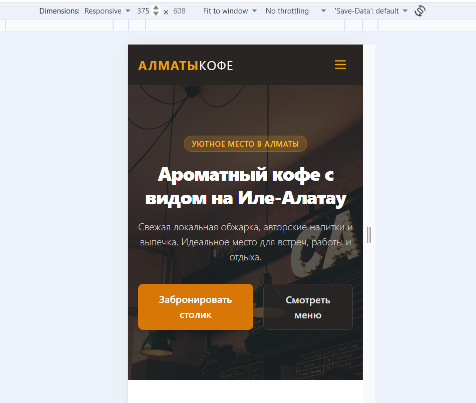
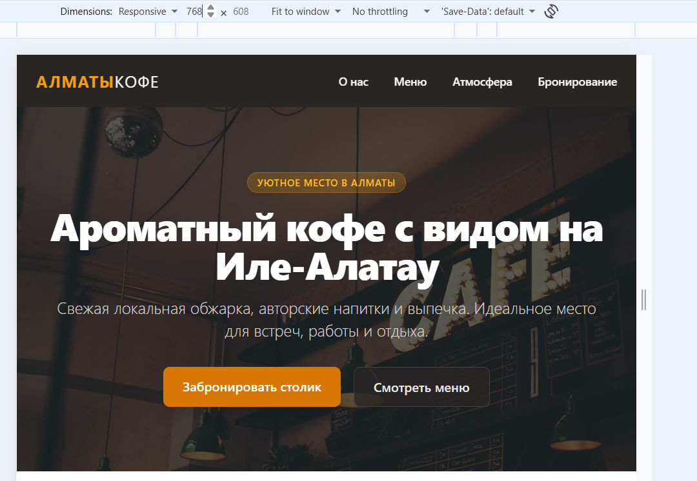
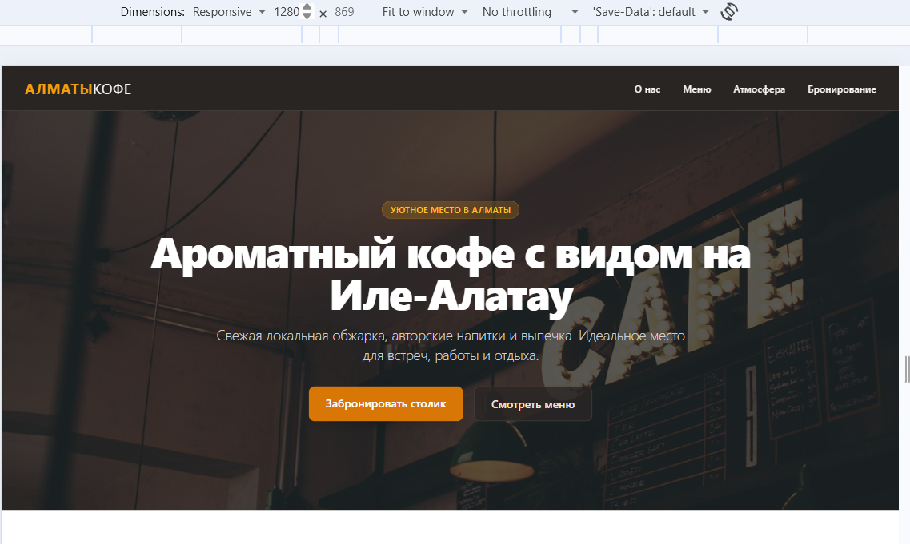

# Лендинг кофейни «Алматы Кофе» (Лабораторная работа №3)

**Тема:** Кофейня в Алматы (меню, атмосфера, бронирование столиков).  
**Трек:** A — Tailwind CSS (Play CDN)  
**Репозиторий:** https://github.com/azatuly/landing-azatuly  
**Живой сайт (GitHub Pages):** https://azatuly.github.io/landing-azatuly/

---

## Что реализовано:
- **Семантика HTML5:** `header`, `nav`, `main`, `section`, `article`, `footer`.
- **Иерархия заголовков:** строго `h1` → `h2` → `h3`.
- **Инструмент Трека A (Tailwind CSS):** вся верстка и сетки реализованы исключительно с использованием утилитарных классов Tailwind CSS без собственного файла раскладки CSS.
- **Адаптивная сетка (Grid):** карточки меню перестраиваются по требованию (`grid-cols-1 md:grid-cols-2 lg:grid-cols-3`).
- **Адаптивное меню:** на мобильных устройствах меню сворачивается и переключается кнопкой.
- **Форма обратной связи:** с полями имя, email, сообщение (`label` и `required` присутствуют).
- **SEO & Accessibility:** теги `title`, `meta description`, `meta viewport`, атрибуты `alt` для картинок.

---

## Почему этот инструмент (Tailwind CSS):
Tailwind CSS — это атомарный (утилитарный) CSS-фреймворк, который позволяет создавать пользовательские интерфейсы прямо в HTML-разметке без необходимости придумывать названия CSS-классов. Он крайне успешен и удобен при быстрой разработке адаптивных сеток благодаря интуитивным префиксам `sm:`, `md:`, `lg:`. Главное его преимущество — отсутствие надобности постоянно переключаться между HTML и CSS файлами. Однако на больших проектах с объёмной разметкой классы в HTML могут выглядеть перегруженными и усложнять чтение структуры. По сравнению с Bootstrap, Tailwind дает полную свободу в дизайне и не привязывает к готовым шаблонам компонентов, а в сравнении с Sass/чистым CSS ускоряет прототипирование за счет готовых утилитарных классов.

---

## Адаптив (Скриншоты)

Ниже представлены скриншоты отображения сайта на разных контрольных точках ширины экрана:

- **375 px (Мобильные устройства):**  
  

- **768 px (Планшеты):**  
  

- **1280 px (Десктопы):**  
  

---

## Использование ИИ (AI Tools)
При выполнении лабораторной работы использовался **Gemini** для генерации адаптивной структуры на утилитах Tailwind CSS и составления шаблона пояснительной записки в README.md.
